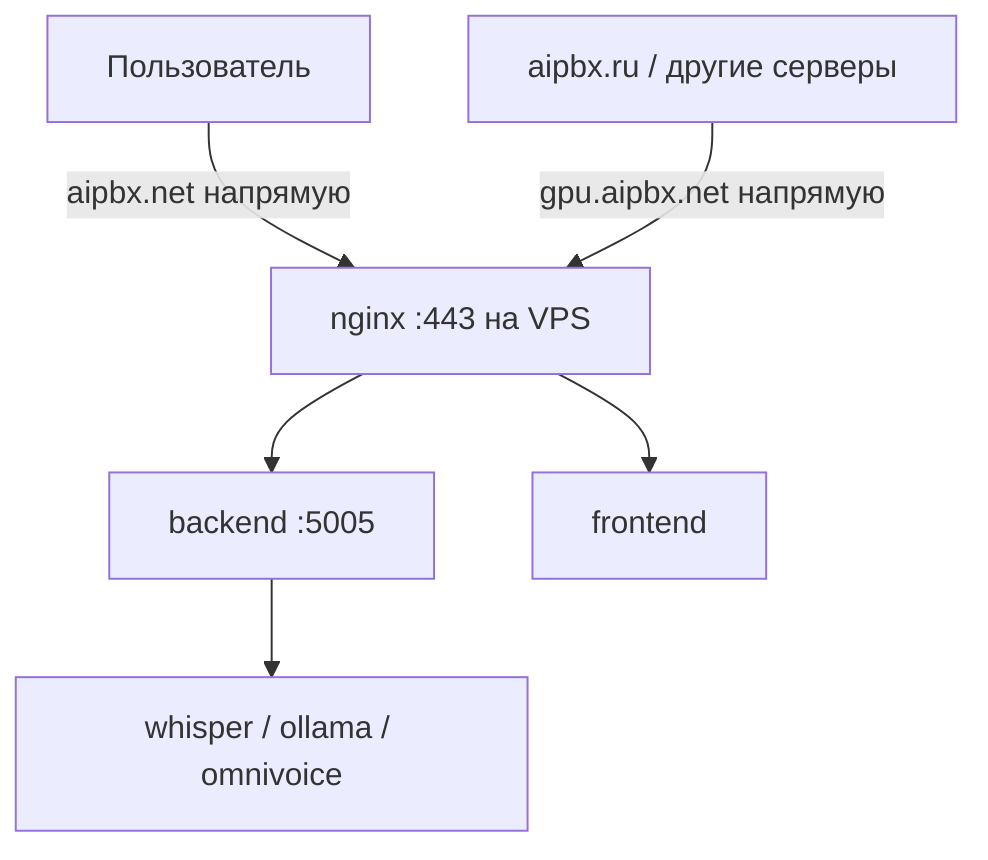

# Миграция aipbx.net на новый сервер

Пошаговое руководство по переносу production-окружения **aipbx.net** (`aipbxnet_production`, тег деплоя `[deploy:1]`).

Документ можно использовать как чеклист при будущих переездах или при миграции sibling-серверов (`aipbxorg_production`, `aipbxru_production`) — отличия указаны в конце.

> **Связанные материалы:** [deploy_architecture.md](../.idea/deploy_architecture.md), [OPERATOR_ANALYTICS_ENV.md](./OPERATOR_ANALYTICS_ENV.md), [restore-db.sh](../scripts/restore-db.sh), [setup-firewall.sh](../scripts/setup-firewall.sh)

---

## Содержание

1. [Обзор](#1-обзор)
2. [Фаза 0 — Подготовка и инвентаризация](#фаза-0--подготовка-и-инвентаризация)
3. [Фаза 1 — Базовая настройка Ubuntu](#фаза-1--базовая-настройка-ubuntu)
4. [Фаза 2 — NVIDIA GPU и Docker](#фаза-2--nvidia-gpu-и-docker)
5. [Фаза 3 — Пользователь деплоя и SSH](#фаза-3--пользователь-деплоя-и-ssh)
6. [Фаза 4 — Структура /app и копирование данных](#фаза-4--структура-app-и-копирование-данных)
7. [Фаза 5 — Переменные окружения](#фаза-5--переменные-окружения)
8. [Фаза 6 — Первый запуск (до DNS cutover)](#фаза-6--первый-запуск-до-dns-cutover)
9. [Фаза 7 — Окно миграции (cutover)](#фаза-7--окно-миграции-cutover)
10. [Фаза 8 — Верификация](#фаза-8--верификация)
11. [Фаза 9 — Пост-миграция](#фаза-9--пост-миграция)
12. [Откат](#откат)
13. [Риски и troubleshooting](#риски-и-troubleshooting)
14. [Миграция других серверов](#миграция-других-серверов)

---

## 1. Обзор

### Что переносится

| Компонент | Назначение |
|-----------|------------|
| `postgres` (pgvector:pg16) | База данных |
| `backend`, `frontend` | API и UI |
| `nginx` + SSL | Reverse proxy, сертификаты из `/app/ssl/` (на origin, без CDN) |
| **GPU:** `whisper`, `ollama`, `omnivoice-tts` | STT / LLM / TTS (только на aipbx.net) |
| `prometheus`, `grafana`, `watchtower`, exporters | Мониторинг и автообновление образов |
| Volume `static/org-documents` | PDF счетов (не должны теряться при recreate) |
| `backups/postgres/` | Дампы БД |

### Структура на сервере

```
/app/
├── aiPBX_backend/              ← git repo бэкенда
├── aiPBX/                      ← git repo фронтенда
├── docker-compose.production.yml
├── .env.production
├── nginx/
│   ├── reverse-proxy.conf
│   └── rate-limit.conf
├── ssl/
│   ├── origin.pem              ← TLS-сертификат (скопировать со старого сервера)
│   └── origin-key.pem
└── backups/postgres/
```

### DNS и трафик (aipbx.net)

**CDN Cloudflare для aipbx.net выключен** — трафик идёт **напрямую на IP сервера** (DNS only / grey cloud, либо DNS у другого регистратора).

| Запись | Назначение | При cutover |
|--------|------------|-------------|
| `aipbx.net` | Основной сайт (frontend + API через nginx) | A → **новый IP** |
| `gpu.aipbx.net` | Прямой доступ к GPU-сервисам на origin | A → **новый IP** (обязательно!) |

`gpu.aipbx.net` используется для **внешних** обращений к GPU (например, с aipbx.ru или других серверов), когда в `.env` заданы `WHISPER_API_URL` / `OLLAMA_URL` с этим хостом. Оба A-record должны указывать на один и тот же IP VPS.



> SSL терминируется **на nginx сервера**, не на Cloudflare. Файлы в `/app/ssl/` — те же, что на старом origin (скопировать as-is). Purge Cache Cloudflare для aipbx.net **не нужен**.

### Стратегия

**Параллельная подготовка + короткое окно простоя** (15–45 мин на финальный sync БД и DNS).


### Пример целевого сервера (aipbx.net, NL, 2026)

| Параметр | Значение |
|----------|----------|
| Hostname | `aipbxnet` |
| ОС | Ubuntu 24.04 Server |
| CPU / RAM / Disk | 8 vCore / 32 GB / 240 GB SSD |
| GPU | NVIDIA RTX A4000 16 GB |
| Main IP | `5.39.217.168/25` |
| Gateway | `5.39.217.129` |
| DNS | Прямо на IP (CDN Cloudflare **выключен**); `gpu.aipbx.net` → тот же IP |

---

## Фаза 0 — Подготовка и инвентаризация

### 0.1. Собрать данные со старого сервера

```bash
ssh aipbxnet@OLD_SERVER_IP   # или текущий SERVER_USER

# Структура и конфиги
ls -la /app/
cat /app/docker-compose.production.yml
grep -v -E 'PASSWORD|SECRET|KEY|TOKEN' /app/.env.production   # только имена переменных

# Состояние
sudo docker compose -f /app/docker-compose.production.yml --env-file /app/.env.production ps
df -h
du -sh /app/backups/postgres /var/lib/docker
ip route | awk '/default/ {print "Gateway:", $3, "Interface:", $5}'
nvidia-smi 2>/dev/null || echo "No GPU on old server"

# Cron бэкапов
crontab -l
sudo crontab -l
```

**Сохранить локально (rsync/scp):**

- `/app/docker-compose.production.yml`
- `/app/.env.production`
- `/app/nginx/`
- `/app/ssl/` (`origin.pem`, `origin-key.pem`)
- Последний дамп из `/app/backups/postgres/`
- Volume backend: `static/org-documents` (если на хосте)
- `crontab` deploy-пользователя

### 0.2. Чеклист внешних интеграций

| Интеграция | Действие при смене IP |
|------------|----------------------|
| **DNS `aipbx.net`** | A-record → новый IP (без CDN/proxy) |
| **DNS `gpu.aipbx.net`** | A-record → **новый IP** (критично для cross-server GPU) |
| **GitHub Environment** `aipbxnet_production` | `SERVER_HOST`, `SERVER_USER`, `SSH_PRIVATE_KEY` |
| **EXTERNAL_HOST** | Новый IP в `.env.production` (см. фазу 5) |
| **WHISPER_API_URL / OLLAMA_URL** на **других** серверах | Если указывают на `gpu.aipbx.net` — после DNS cutover заработают автоматически; проверить после миграции |
| **Stripe webhooks** | URL по домену не меняется; проверить доставку после cutover |
| **Telegram Bot** | `setWebhook` на `https://aipbx.net/...` после cutover |
| **OAuth providers** | Redirect URI по домену — обычно без изменений |
| **Asterisk / PBX** | RTP UDP `:3032` → новый IP |

### 0.3. Оценка времени

| Этап | Время |
|------|-------|
| Фазы 0–3 (подготовка сервера) | 2–4 ч |
| Фазы 4–6 (копирование, тест без DNS) | 2–3 ч |
| Фаза 7 (cutover) | 15–45 мин |
| Фазы 8–9 (верификация) | 1–2 ч |
| **Итого** | ~1 рабочий день |

---

## Фаза 1 — Базовая настройка Ubuntu

Выполняется от `root` на новом сервере.

### 1.1. Hostname и сеть

```bash
hostnamectl set-hostname aipbxnet

# Netplan — параметры от провайдера (пример)
# addresses: [<NEW_IP>/25]
# gateway: <GATEWAY>
sudo netplan apply

ip addr
ip route
ping -c 3 8.8.8.8
```

### 1.2. Базовые пакеты

```bash
apt update && apt upgrade -y
apt install -y git curl wget htop ufw fail2ban unzip jq iptables-persistent
```

### 1.3. Firewall (UFW)

Публичные порты для aipbx.net:

| Порт | Назначение |
|------|------------|
| `22/tcp` | SSH |
| `80/tcp` | HTTP (redirect → HTTPS) |
| `443/tcp` | HTTPS |
| `3032/udp` | RTP / Asterisk |

Ограниченные (только доверенные IP): `11434/tcp` (Ollama), `9090/tcp` (Prometheus), `3000/tcp` (Grafana).

```bash
ufw default deny incoming
ufw default allow outgoing
ufw allow 22/tcp
ufw allow 80/tcp
ufw allow 443/tcp
ufw allow 3032/udp
ufw enable
ufw status numbered
```

Или интерактивно: [scripts/setup-firewall.sh](../scripts/setup-firewall.sh) (отредактировать `TRUSTED_IPS` перед запуском).

---

## Фаза 2 — NVIDIA GPU и Docker

> **aipbx.net** — единственный сервер с GPU-сервисами в backend deploy workflow (`aipbxnet_production`).

### 2.1. Драйвер NVIDIA

**Не хардкодить версию.** Использовать рекомендацию Ubuntu:

```bash
ubuntu-drivers devices
# Для RTX A4000 на Ubuntu 24.04 обычно: nvidia-driver-595-open (recommended)

apt update
apt install -y nvidia-driver-595-open   # или значение из "recommended"
reboot
```

После перезагрузки:

```bash
nvidia-smi
# Ожидается: RTX A4000, Driver Version 595.x
```

Предупреждения `udevadm hwdb is deprecated` и `aplay command not found` — не критичны.

**Fallback:** если GPU-контейнеры не работают с `-open`, попробовать `nvidia-driver-595` (проприетарный kernel module).

### 2.2. Docker Engine

```bash
curl -fsSL https://get.docker.com | sh
docker --version
docker compose version
```

### 2.3. NVIDIA Container Toolkit

```bash
curl -fsSL https://nvidia.github.io/libnvidia-container/gpgkey | \
  gpg --dearmor -o /usr/share/keyrings/nvidia-container-toolkit-keyring.gpg

curl -fsSL https://nvidia.github.io/libnvidia-container/stable/deb/nvidia-container-toolkit.list | \
  sed 's#deb https://#deb [signed-by=/usr/share/keyrings/nvidia-container-toolkit-keyring.gpg] https://#g' | \
  tee /etc/apt/sources.list.d/nvidia-container-toolkit.list

apt update
apt install -y nvidia-container-toolkit
nvidia-ctk runtime configure --runtime=docker
systemctl restart docker
```

**Проверка GPU в Docker** (тег `nvidia/cuda:12.0-base` на Docker Hub **устарел**):

```bash
docker run --rm --gpus all nvidia/cuda:12.6.3-base-ubuntu24.04 nvidia-smi
```

Успех: в контейнере видна RTX A4000, как на хосте.

### 2.4. Docker + UFW (iptables)

На aipbx.net Docker работает с `"iptables": false` для совместимости с UFW. Deploy workflow добавляет MASQUERADE вручную.

```bash
IFACE=$(ip route | awk '/default/ {print $5}')
echo "Default interface: $IFACE"

tee /etc/docker/daemon.json <<EOF
{
  "iptables": false,
  "log-driver": "json-file",
  "log-opts": { "max-size": "50m", "max-file": "3" }
}
EOF

systemctl restart docker

# Подсеть Docker — проверить после первого compose up (часто 172.18.0.0/16)
iptables -t nat -A POSTROUTING -s 172.18.0.0/16 -o "$IFACE" -j MASQUERADE
netfilter-persistent save
```

> **Важно:** в [.github/workflows/deploy.yml](../.github/workflows/deploy.yml) захардкожен интерфейс `ens1`. После миграции проверить фактическое имя (`eth0`, `ens3`, …) и при необходимости обновить workflow.

---

## Фаза 3 — Пользователь деплоя и SSH

GitHub Actions подключается по секрету **`SERVER_USER`** (не hardcoded в репозитории). Для aipbx.net рекомендуется пользователь **`aipbxnet`**.

### 3.1. Создание пользователя

```bash
adduser aipbxnet
usermod -aG sudo,docker aipbxnet
```

### 3.2. SSH-ключ для GitHub Actions

```bash
mkdir -p /home/aipbxnet/.ssh
chmod 700 /home/aipbxnet/.ssh

# Вставить публичный ключ (пара к SSH_PRIVATE_KEY в GitHub)
nano /home/aipbxnet/.ssh/authorized_keys

chmod 600 /home/aipbxnet/.ssh/authorized_keys
chown -R aipbxnet:aipbxnet /home/aipbxnet/.ssh
```

Генерация новой пары (локально):

```bash
ssh-keygen -t ed25519 -C "github-actions-aipbxnet" -f ~/.ssh/github_aipbxnet -N ""
```

### 3.3. Sudo без пароля (для CI)

Deploy workflow использует `sudo docker`, `sudo chown`, `sudo iptables`:

```bash
tee /etc/sudoers.d/aipbxnet <<'EOF'
aipbxnet ALL=(ALL) NOPASSWD: /usr/bin/docker, /usr/bin/chown, /usr/sbin/iptables
EOF
chmod 440 /etc/sudoers.d/aipbxnet
visudo -c
```

### 3.4. GitHub Environment `aipbxnet_production`

| Secret | Значение |
|--------|----------|
| `SERVER_HOST` | IP нового сервера (напр. `5.39.217.168`) |
| `SERVER_USER` | `aipbxnet` |
| `SSH_PRIVATE_KEY` | приватный ключ, пара к `authorized_keys` |

Проверка:

```bash
ssh -i ~/.ssh/github_aipbxnet aipbxnet@NEW_SERVER_IP
```

### 3.5. SSH hardening (после проверки ключа)

```bash
# /etc/ssh/sshd_config
# PermitRootLogin no
# PasswordAuthentication no
systemctl reload sshd
```

---

## Фаза 4 — Структура /app и копирование данных

### 4.1. Каталоги и права

```bash
mkdir -p /app/{nginx,ssl,backups/postgres}
chown -R aipbxnet:aipbxnet /app
```

### 4.2. Клонирование репозиториев

От пользователя `aipbxnet`:

```bash
cd /app
git clone https://github.com/<org>/aiPBX_backend.git
git clone https://github.com/<org>/aiPBX.git
cd aiPBX_backend && git checkout master
cd /app/aiPBX && git checkout master
```

### 4.3. Копирование со старого сервера

```bash
# С локальной машины или напрямую между серверами
OLD= aipbxnet@OLD_SERVER_IP
NEW= aipbxnet@NEW_SERVER_IP

rsync -avz $OLD:/app/docker-compose.production.yml /tmp/
rsync -avz $OLD:/app/.env.production /tmp/
rsync -avz $OLD:/app/nginx/ /tmp/nginx/
rsync -avz $OLD:/app/ssl/ /tmp/ssl/
rsync -avz $OLD:/app/backups/postgres/ /tmp/backups/postgres/

rsync -avz /tmp/docker-compose.production.yml $NEW:/app/
rsync -avz /tmp/.env.production $NEW:/app/
rsync -avz /tmp/nginx/ $NEW:/app/nginx/
rsync -avz /tmp/ssl/ $NEW:/app/ssl/
rsync -avz /tmp/backups/postgres/ $NEW:/app/backups/postgres/

# PDF счетов (если volume на хосте — путь уточнить в docker-compose.production.yml)
# rsync -avz $OLD:/path/to/static/org-documents/ $NEW:/path/to/static/org-documents/
```

```bash
chown -R aipbxnet:aipbxnet /app
```

---

## Фаза 5 — Переменные окружения

Файл: `/app/.env.production`

### Обязательно изменить при смене IP

| Переменная | Пример для нового сервера | Назначение |
|------------|---------------------------|------------|
| `EXTERNAL_HOST` | `5.39.217.168:3032` | RTP/UDP для Asterisk ([ari-connection.ts](../src/ari/ari-connection.ts)) |

### На самом aipbx.net (локальный Docker)

| Переменная | Значение |
|------------|----------|
| `API_URL` / `CLIENT_URL` | `https://aipbx.net` |
| `WHISPER_API_URL` | обычно внутренний Docker (`http://whisper:9000/...`) |
| `OLLAMA_URL` | `http://ollama:11434` |
| `OMNIVOICE_TTS_URL` | внутренний URL контейнера |

### На других серверах (aipbx.ru и т.д.)

Если GPU вызывается **через `gpu.aipbx.net`**, менять URL в `.env` **не нужно** — достаточно обновить DNS A-record `gpu.aipbx.net` на новый IP. После cutover проверить доступность:

```bash
curl -I https://gpu.aipbx.net   # или конкретный path из WHISPER_API_URL
```

### Frontend build args

Задаются в `docker-compose.production.yml` (`FRONTEND_API_URL`, `STRIPE_PUBLISHABLE_KEY`, …). При смене только IP, **без смены домена**, пересборка фронтенда не требуется.

---

## Фаза 6 — Первый запуск (до DNS cutover)

Пока DNS указывает на старый сервер — полная проверка на новом.

### 6.1. PostgreSQL и restore

```bash
cd /app
sudo docker compose -f docker-compose.production.yml --env-file .env.production up -d postgres
sleep 20

sudo /app/aiPBX_backend/scripts/restore-db.sh /app/backups/postgres/LATEST.sql.gz
```

### 6.2. Основной стек

Сначала посмотрите, какие сервисы реально описаны в вашем compose:

```bash
cd /app
sudo docker compose -f docker-compose.production.yml --env-file .env.production config --services
```

Запускайте **только существующие** сервисы. Типичный набор для aipbx.net:

```bash
sudo docker compose -f docker-compose.production.yml --env-file .env.production up -d \
  --build backend frontend nginx watchtower \
  prometheus grafana node-exporter postgres-exporter
```

> **SSL:** сертификаты в `/app/ssl/` (скопированы со старого сервера). nginx терминирует TLS **на origin** — CDN Cloudflare не участвует. **certbot** в compose обычно отсутствует; если сертификат истекает — продлевать тем же способом, что на старом сервере.

Альтернатива — поднять всё из compose, кроме GPU-профилей:

```bash
sudo docker compose -f docker-compose.production.yml --env-file .env.production up -d --build
```

### 6.3. GPU-сервисы (aipbx.net)

VRAM budget (RTX A4000, 16 GB):

| Сервис | VRAM | Примечание |
|--------|------|------------|
| Whisper large-v3 INT8 | ~4.5 GB | analytics STT, постоянно |
| OmniVoice TTS INT8 | ~3.5 GB | Pipeline B TTS, постоянно |
| Gemma 4 E4B (Ollama) | ~3.0 GB | выгружается после idle |
| **Peak** | ~11 GB | кратковременно при звонках |
| **Typical** | ~8 GB | без активных звонков |

```bash
IFACE=$(ip route | awk '/default/ {print $5}')
sudo iptables -t nat -C POSTROUTING -s 172.18.0.0/16 -o "$IFACE" -j MASQUERADE 2>/dev/null || \
  sudo iptables -t nat -A POSTROUTING -s 172.18.0.0/16 -o "$IFACE" -j MASQUERADE

sudo docker compose -f docker-compose.production.yml --env-file .env.production --profile gpu up -d \
  --force-recreate whisper

sudo docker compose -f docker-compose.production.yml --env-file .env.production --profile gpu-full up -d \
  --force-recreate ollama

sudo docker compose -f docker-compose.production.yml --env-file .env.production --profile gpu-full up -d \
  --build --force-recreate omnivoice-tts

sleep 10
sudo docker exec app-ollama-1 ollama pull gemma4:e4b
sudo docker exec app-ollama-1 ollama pull nomic-embed-text
```

### 6.4. Локальная проверка (без DNS)

На рабочей машине в `/etc/hosts` (или `C:\Windows\System32\drivers\etc\hosts`):

```
5.39.217.168 aipbx.net
5.39.217.168 gpu.aipbx.net
```

```bash
curl -k https://aipbx.net/api
curl -k https://gpu.aipbx.net/   # если nginx проксирует GPU-subdomain
sudo docker inspect --format='{{.State.Health.Status}}' app-backend-1
sudo docker compose -f /app/docker-compose.production.yml --env-file /app/.env.production ps
nvidia-smi
```

---

## Фаза 7 — Окно миграции (cutover)

Рекомендуется: низкая нагрузка, TTL DNS = 300 с (5 мин) у регистратора / DNS-провайдера.

### 7.1. За 1 час до cutover

На **старом** сервере — свежий дамп:

```bash
cd /app
source .env.production
sudo docker compose -f docker-compose.production.yml exec -T postgres \
  pg_dump -U "$DB_USER" -d "$DB_NAME" -Fc | gzip > backups/postgres/pre_migration_$(date +%Y%m%d_%H%M%S).sql.gz

rsync -avz backups/postgres/pre_migration_*.sql.gz aipbxnet@NEW_IP:/app/backups/postgres/
```

### 7.2. Cutover (порядок)

1. **Maintenance** (опционально): custom 503 в nginx.
2. **Остановить запись на старом:**
   ```bash
   sudo docker compose -f /app/docker-compose.production.yml stop backend
   ```
3. **Финальный дамп** → rsync → **restore на новом** (фаза 6.1).
4. **Синхронизировать** `static/org-documents` (rsync).
5. **Перезапустить backend** на новом:
   ```bash
   sudo docker compose -f /app/docker-compose.production.yml --env-file /app/.env.production up -d \
     --build --force-recreate backend
   ```
6. **Обновить GitHub Secrets** (`aipbxnet_production`): `SERVER_HOST`, при необходимости `SSH_PRIVATE_KEY`.
7. **DNS cutover** (оба record на **новый IP**, proxy/CDN **выключен**):
   - `aipbx.net` → A
   - `gpu.aipbx.net` → A
8. **Telegram webhook** (если используется):
   ```bash
   curl "https://api.telegram.org/bot<TOKEN>/setWebhook?url=https://aipbx.net/api/telegram/webhook"
   ```
9. **Asterisk:** убедиться, что RTP идёт на новый IP (`EXTERNAL_HOST`).

---

## Фаза 8 — Верификация

| # | Проверка | Команда / действие |
|---|----------|-------------------|
| 1 | API health | `curl https://aipbx.net/api` |
| 2 | Frontend | Открыть `https://aipbx.net` |
| 3 | Backend container | `docker inspect --format='{{.State.Health.Status}}' app-backend-1` → `healthy` |
| 4 | Login / OAuth | Вход через провайдер |
| 5 | GPU STT | Тест operator analytics / whisper logs |
| 5b | gpu.aipbx.net | `dig +short gpu.aipbx.net` → новый IP; curl с aipbx.ru если GPU вызывается оттуда |
| 6 | Ollama | `docker logs app-ollama-1 --tail 50` |
| 7 | Stripe | Test webhook из Dashboard |
| 8 | Звонки | Тестовый звонок, RTP UDP 3032 |
| 9 | CI/CD | GitHub Actions → Run workflow → `aipbxnet_production` |
| 10 | Мониторинг | Grafana `:3000`, Prometheus `:9090` |
| 11 | Диск | `docker system df`, `df -h` |

```bash
sudo docker compose -f /app/docker-compose.production.yml --env-file /app/.env.production ps
sudo docker compose -f /app/docker-compose.production.yml logs --tail=100 backend
dig +short aipbx.net
dig +short gpu.aipbx.net
```

---

## Фаза 9 — Пост-миграция

- [ ] Перенести **cron бэкапов** PostgreSQL со старого сервера.
- [ ] Настроить **fail2ban** для SSH.
- [ ] Мониторить **диск**: Ollama + Docker images ~50–80 GB на 240 GB SSD.
- [ ] Держать **старый сервер** 3–7 дней (read-only), затем остановить контейнеры.
- [ ] Обновить **deploy.yml**: имя сетевого интерфейса в MASQUERADE, комментарий VRAM (A4000 16 GB).
- [ ] Обновить **setup-firewall.sh**: IP aipbx.net в `TRUSTED_IPS` при необходимости.

### Ручной деплой (справочник)

| Действие | Команда |
|----------|---------|
| Деплой aipbx.net | Коммит с `[deploy:1]` в `aiPBX_backend` или `aiPBX` |
| Ручной деплой | GitHub Actions → Run workflow → `aipbxnet_production` |
| Rebuild на сервере | `sudo docker compose -f docker-compose.production.yml --env-file .env.production up -d --build --force-recreate <service>` |

---

## Откат

Если после cutover критические проблемы:

1. В DNS вернуть A-record **`aipbx.net`** и **`gpu.aipbx.net`** на **старый IP**.
2. На старом сервере: `docker compose ... up -d backend` (БД на старом — последний pre-cutover дамп).
3. Дождаться propagation DNS (`dig +short aipbx.net`).
4. Новый сервер оставить для диагностики, не удалять сразу.

---

## Риски и troubleshooting

| Проблема | Решение |
|----------|---------|
| `invalid user: aipbxnet` | Сначала `adduser aipbxnet`, потом `chown` |
| `nvidia/cuda:12.0-base: not found` | Использовать `nvidia/cuda:12.6.3-base-ubuntu24.04` |
| `could not select device driver ""` | Установить nvidia-container-toolkit, `systemctl restart docker` |
| Контейнеры без интернета (UFW) | `iptables: false` + MASQUERADE на правильный `$IFACE` |
| `git pull` Permission denied | `sudo chown -R $(whoami):$(whoami) /app/aiPBX_backend` (CI делает автоматически) |
| Потеря PDF счетов | Volume на `static/org-documents` в compose + rsync |
| Долгий `ollama pull` | Выполнять на фазе 6, до cutover |
| DNS не обновился | `dig +short aipbx.net gpu.aipbx.net`; TTL; кэш resolver |
| aipbx.ru не видит GPU | Проверить `gpu.aipbx.net` → новый IP и nginx vhost для GPU |

---

## Миграция других серверов

| Параметр | aipbx.net | aipbx.com (org) | aipbx.ru |
|----------|-----------|-----------------|----------|
| GitHub Environment | `aipbxnet_production` | `aipbxorg_production` | `aipbxru_production` |
| Deploy tag | `[deploy:1]` | `[deploy:2]` | `[deploy:3]` |
| DNS | Прямо на IP; `gpu.aipbx.net` → тот же VPS; CDN **выключен** | Cloudflare | Яндекс.Облако |
| GPU-сервисы | **Да** (deploy.yml) | Нет | Уточнять по актуальному deploy.yml |
| Deploy user (рекомендация) | `aipbxnet` | `aipbxorg` | `aipbxru` |

Общие фазы 0–9 применимы ко всем серверам; **фазы 2.1, 2.3, 6.3** — только для GPU-хостов.

---

## Быстрый чеклист

```
□ Фаза 0: инвентаризация старого сервера, бэкап конфигов и БД
□ Фаза 1: Ubuntu, сеть, UFW
□ Фаза 2: nvidia-driver (ubuntu-drivers recommended), Docker, Container Toolkit, GPU test
□ Фаза 3: пользователь aipbxnet, SSH, GitHub Secrets
□ Фаза 4: /app, rsync конфигов, git clone
□ Фаза 5: EXTERNAL_HOST и прочие env
□ Фаза 6: compose up, restore DB, GPU, тест через /etc/hosts
□ Фаза 7: финальный dump, DNS cutover (aipbx.net + gpu.aipbx.net), webhooks
□ Фаза 8: smoke tests + CI deploy [deploy:1]
□ Фаза 9: cron, fail2ban, decommission старого сервера
```

---

*Документ актуален для миграции aipbx.net на Ubuntu 24.04 с RTX A4000. Обновляйте IP, пути volume и имена интерфейсов под конкретный VPS.*
